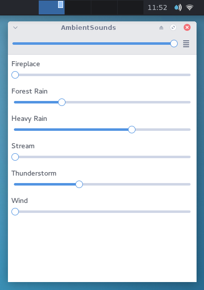

AmbientSounds
=============

Ambient sound player inspired by Noizio, A Soft Murmur, etc...

AmbientSounds is licensed under the MIT license.

The application's icon is based on icons from the `Moka <http://snwh.org/moka/>`_ icon theme by
Sam Hewitt, and is licensed under the
`CC BY-SA <http://creativecommons.org/licenses/by-sa/4.0/legalcode>`_ license.

Requirements
------------

 - Python 2
 - PyGObject >= 3.16
 - `pygame <http://www.pygame.org/>`_
 - `mutagen <https://bitbucket.org/lazka/mutagen>`_

Sounds
------

The sound files, as well as their licenses and authors are available in the
`ambientsounds <https://github.com/Muges/ambientsounds>`_ repository. You should put them in one of
the following directories :

 - ``~/.config/ambientsounds/sounds``
 - ``/usr/share/ambientsounds/sounds``
 - ``./sounds``

Usage
-----

 - Left-click on the tray icon to mute or unmute
 - Right-click on the tray icon to show the window and change the volume of the sounds
